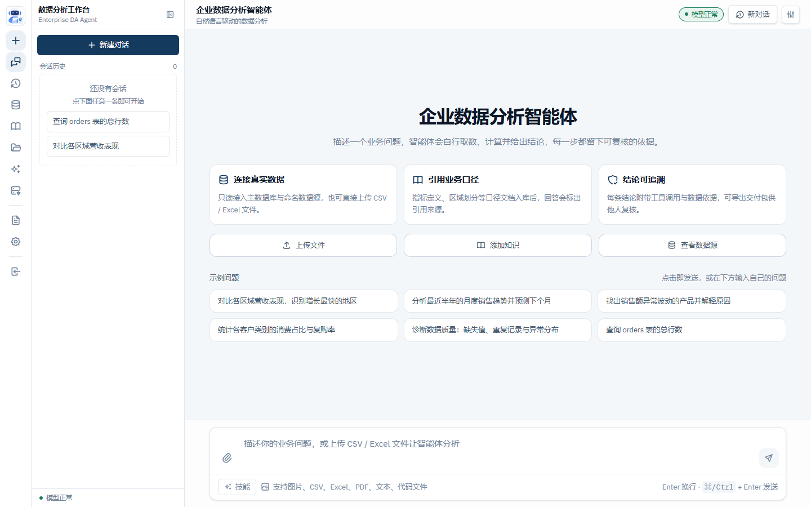
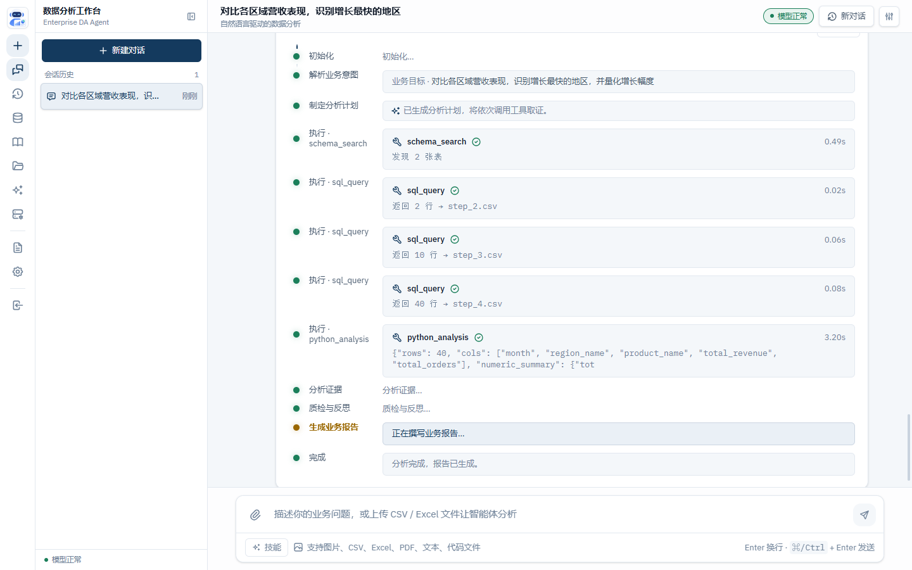
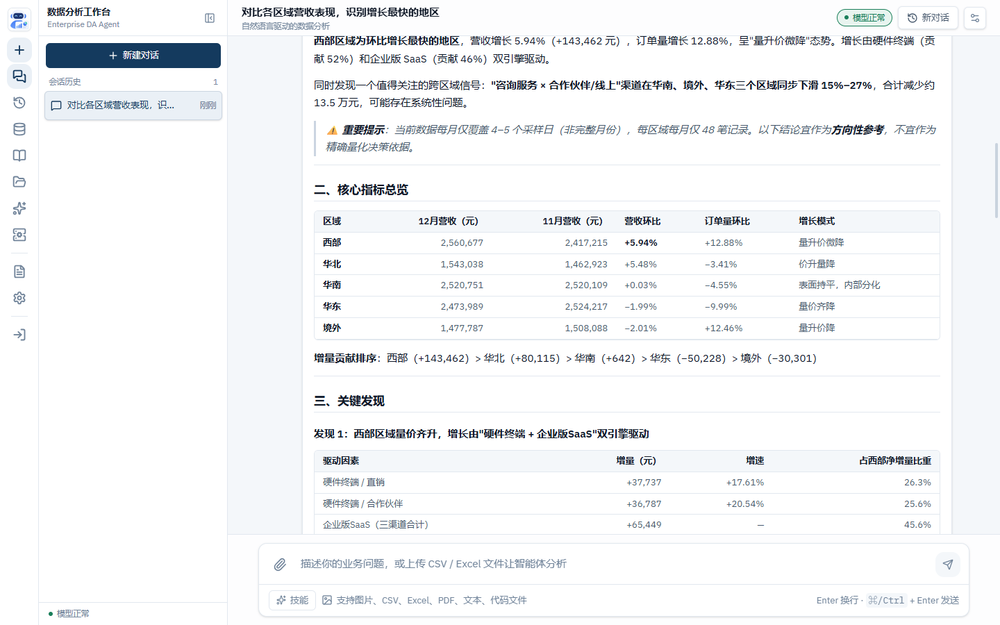
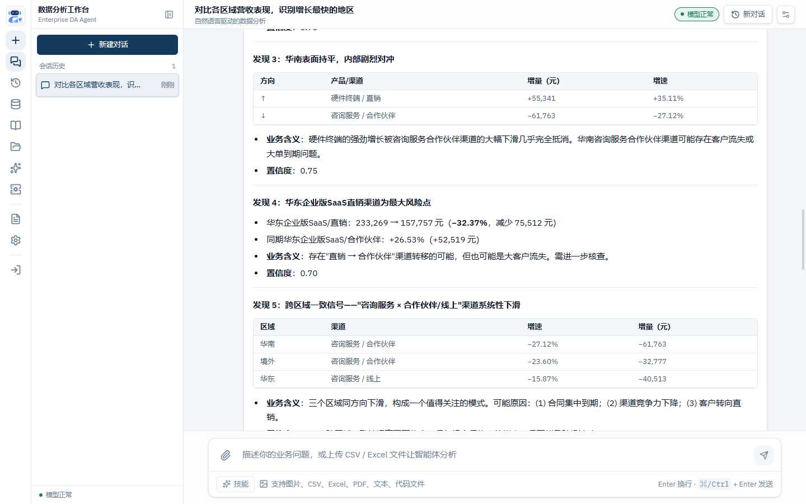
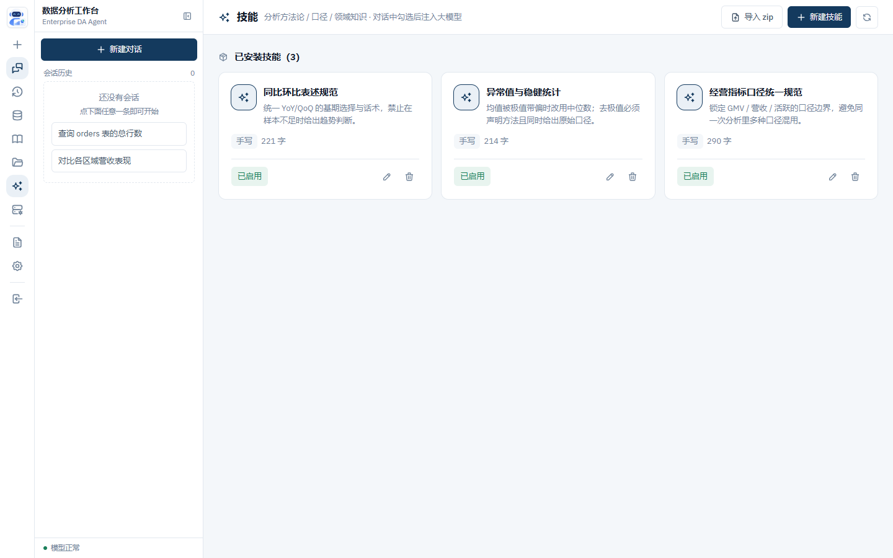
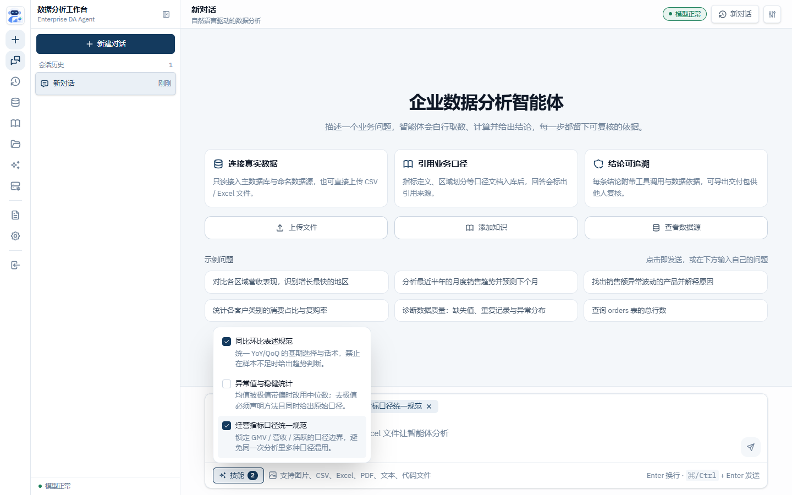
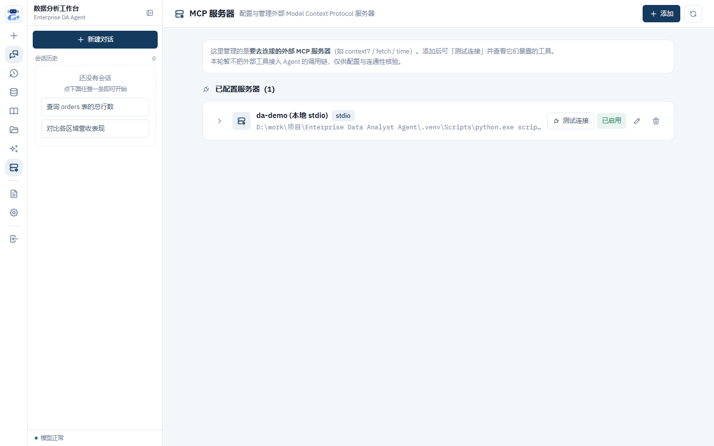
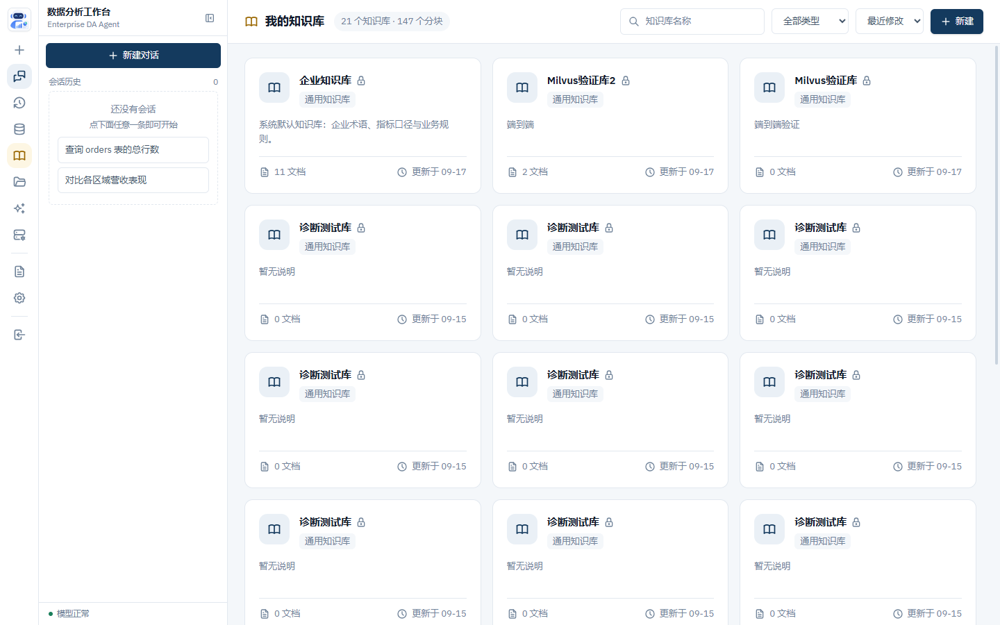

<div align="center">

# 企业数据分析智能体

**Enterprise Data Analyst Agent** · 由自然语言驱动的「取数 → 分析 → 结论 → 交付」Agent

把业务问题交给它，它自己理解意图、制定计划、调用工具取真实数据、做统计分析、质检反思，
最后产出**每条结论都带证据**的业务报告 —— 每一步都留下可复核的依据。

[](https://www.python.org/)
[](https://fastapi.tiangolo.com/)
[](https://react.dev/)
[](#)

</div>

> **RAG 基准（合成语料，offline）：Recall@1 37.5% · Recall@3 68.1% · Recall@5 75.0%。** 完整报告见 [benchmarks/RESULTS.md](benchmarks/RESULTS.md)。

---

## 目录

- [一、这是什么](#一这是什么)
- [二、界面预览](#二界面预览)
- [三、核心能力](#三核心能力)
- [四、架构](#四架构)
- [五、快速开始](#五快速开始)
- [六、一次分析的完整链路](#六一次分析的完整链路)
- [七、功能详解](#七功能详解)
- [八、API 一览](#八api-一览)
- [九、配置项](#九配置项)
- [十、目录结构](#十目录结构)
- [十一、测试与评测](#十一测试与评测)
- [十二、扩展点](#十二扩展点)
- [十三、工程参照](#十三工程参照)
- [十四、文档索引](#十四文档索引)
- [十五、已知局限](#十五已知局限)

---

## 一、这是什么

这不是「接个大模型 + 让它写 SQL」的玩具。它的设计约束是**企业分析师真正在意的那几件事**：

> **Understand before Execute · Evidence before Conclusion ·
> Validation before Recommendation · Business Value over Technical Complexity**

落到实现上，就是四条硬规矩：

| 原则 | 具体落地 |
|---|---|
| **先理解再执行** | 意图先收敛成结构化 `Context`（目标 / 指标 / 时间范围 / 维度）才开始规划；问题太模糊会**反问澄清**而不是硬猜 |
| **先证据再结论** | 结论只能来自工具真实返回值；报告里每个数值都能沿 `claim → sql_id → SQL → 行样本` 追回去 |
| **先验证再建议** | Reflection 是**质量门禁**而非装饰：证据不足自动 REPLAN；join 放大、多重比较、未检验对比会被拦或被标注 |
| **业务价值优先** | 输出是业务报告（摘要 / 指标 / 发现 / 根因 / 建议 / 局限），不是查询结果的堆砌 |

编排形态对齐规格说明书的 **Context → Planner → Executor → Analyst → Reflection → Reporter** 自适应流水线，
并按企业落地需要补齐了鉴权、数据权限、脱敏、交付导出、可观测性、评测门禁等一整套工程面。

---

## 二、界面预览

> 下面的截图都按**仓库相对路径**引用（GitHub / VS Code / 常见渲染器均可正常显示）。
> 若你的 Markdown 预览器不解析相对图片路径（少数本地客户端存在此限制），
> 请直接打开 [`docs/readme-preview.html`](docs/readme-preview.html) —— 该文件把全部截图内联为 base64，
> 不依赖任何路径解析。

**对话主界面** —— 示例问题一键起手，输入框下方可直接挂技能。



**真实执行轨迹** —— 6 个编排节点逐段点亮，每次工具调用带工具名、摘要、耗时，可展开看日志。
下图是真实 LLM + 真实 SQLite 跑出来的一轮（问题：*对比各区域营收表现，识别增长最快的地区*）：



**业务报告** —— 结构化章节 + 指标表格，关键数字与驱动因素拆解，并主动标注数据覆盖局限。



**关键发现** —— 每条发现给出证据、业务含义与置信度，可疑模式会被显式指出。



**技能管理** —— 用 `SKILL.md` 沉淀方法论 / 口径 / 领域知识；支持 zip 导入（兼容 Anthropic 约定）。



**对话中勾选技能** —— 只把勾中的技能注入**本轮**请求，勾选跨消息保留。
下图勾了「同比环比表述规范」和「经营指标口径统一规范」：



**MCP 服务器管理** —— 配置要去连接的外部 MCP server（stdio / sse / http），
保存前可先「测试连接」，连上后直接看到它暴露的工具清单：



**知识库** —— 多知识库隔离，文档 / 网页 / 纯文本三种入库方式，可对单库做检索预览。



---

## 三、核心能力

| 能力 | 说明 | 主要代码 |
|---|---|---|
| **自适应编排** | 6 阶段流水线；Reflection 判定 PASS / REPLAN / FAIL；`MAX_REPLANS` 封顶 | `core/agents/data_analyst/graph.py`、`nodes.py` |
| **增量迭代** | 同 `session_id` 下「基于上一结果」下钻 / 改期 / 换粒度，只重跑目标阶段；不安全请求自动回退全链 | `core/agents/data_analyst/iteration.py` |
| **澄清回路** | 问题过模糊 → 反问（≤3 个具体问题），`status=CLARIFY`；作答后带 `clarification_answer` 续跑 | `nodes.py`、`docs/specs/CLARIFY/` |
| **工具层（9 个）** | `sql_query` / `freeform` / `python_analysis` / `schema_search` / `dataset_profile` / `knowledge_search` / `visualization` / `generate_report` / `image_analyze` | `core/tools/` |
| **只读 SQL** | 默认禁 DML/DDL、单语句、行数上限；执行前做方言预检 | `core/tools/sql_tool.py`、`sql_precheck.py` |
| **Python 沙箱** | AST 预扫屏蔽 `os/subprocess/socket/...`；子进程 `-I` 隔离 + 超时；产物靠 `DA_WORKDIR` 跨步传递 | `core/tools/python_tool.py` |
| **质量门禁** | 6 类 profile + 5 类统计 + 2 类对抗规则；BLOCK / REPLAN / ANNOTATE 分级 | `gate.py`、`rigor.py` |
| **统计严谨性** | t 检验 / 卡方 / 比例检验；未检验的对比必须标注，不得写「显著」 | `rigor.py`、`stats_notes` |
| **口径管理** | 口径注册表 + 可比性检查（期间口径 / 分母 / 粒度不一致会拦） | `caliber.py`、`caliber_registry.py` |
| **业务语义** | 维表取值、外键关系、枚举分布自动采集，给规划与写码提供先验 | `semantics.py`、`scripts/build_semantics.py` |
| **知识库 / RAG** | 混合检索（BM25 + 向量）、可选重排、多跳拆分、query 改写、echo 降级、低置信回退 | `core/rag/`、`etl/` |
| **记忆** | 会话级短期记忆（含滚动摘要）+ 跨会话长期结论/教训，三因子排序召回 | `core/memory/` |
| **技能（Skills）** | `SKILL.md` 目录形态，zip 导入，对话时手动勾选注入 | `core/skills/store.py` |
| **MCP 双向** | 出：把只读工具暴露给外部客户端；入：管理要去连的外部 MCP server | `integrations/mcp_server.py`、`mcp_client/` |
| **用户鉴权** | 注册 / 登录 / 角色 / 头像 / 登录审计；微信扫码登录（可模拟） | `core/security/users.py`、`wechat.py` |
| **数据权限** | 表级白名单 / 列级黑名单 / 行级过滤 + 每用户配额 + 会话归属校验 | `core/security/auth.py`、`data_guard.py` |
| **脱敏与 DLP** | 进 LLM 上下文的样本默认脱敏（`sample`/`strict`）；字段级 DLP；交付物**保留原值**并有水印 | `core/security/masking.py`、`dlp.py`、`watermark.py` |
| **审计** | ALLOW / DENY 全量落 `data/audit/*.jsonl`；HITL 人工确认钩子 | `core/security/audit_store.py`、`hitl.py` |
| **文件库** | 目录树 / 上传 / 预览 / 下载 / 搜索；路径逃逸与符号链接拦截 | `core/filestore.py`、`api/routes/files.py` |
| **附件解析** | CSV / Excel / 文本 / 图片进 Agent 上下文；图片诚实标注「未接视觉解析」 | `core/attachments.py` |
| **交付导出** | 一次拿走 报告 + SQL + 数据 + 溯源（zip），附 manifest | `api/routes/export.py` |
| **可观测性** | `/metrics`（Prometheus 文本）+ 请求计时 + OTel 钩子 + trace 落盘 + 调试接口 | `infrastructure/observability/` |
| **降级优先** | Redis / Milvus / PostgreSQL 全可选；LLM 不可用退化为 Mock，**且降级对调用方可见** | `config.py`、`infrastructure/llm/` |

---

## 四、架构


节点职责一览：

| 阶段 | 输入 → 输出 | 关键约束 |
|---|---|---|
| **Context Resolver** | 用户问题 → 结构化 `Context`（目标/指标/时间/维度） | 模糊即 `CLARIFY`，不猜 |
| **Planner** | `Context` + 工具表 → 最小可执行计划（steps/tools/依赖） | 计划必须可执行、步骤数 ≤ `MAX_PLAN_STEPS` |
| **Executor** | 计划 → 逐步骤工具结果 | 只读、沙箱、可重试、审计留痕 |
| **Analyst** | 工具结果 → 证据化的发现 / 假设 / 建议 | 每条发现必须挂证据 |
| **Reflection** | 分析 → PASS / REPLAN / FAIL | 数据质量、指标口径、证据充分性、逻辑自洽 |
| **Reporter** | 分析 + 证据 → 结构化业务报告 | 数值、口径、局限缺一不可 |

前端到服务的流式链路：


四大原则贯穿始终：**Understand before Execute · Evidence before Conclusion ·
Validation before Recommendation · Business Value over Technical Complexity**。

---

## 五、快速开始

### 1. 准备依赖

```bash
python -m venv .venv
# Windows
.venv\Scripts\activate
# macOS / Linux
source .venv/bin/activate

pip install -r requirements.txt
python scripts/generate_sample.py          # 生成 data/sample_enterprise.db（基础星型样例库）
python scripts/generate_analyst_sample.py  # 可选：data/sample_analyst.db（评测专用超集库）
```

> `sample_analyst.db` 在基础星型模型之上补齐 `fact_orders`(订单/GMV)、`fact_traffic`(流量/转化率)、
> 8 个渠道、4 个品类、跨年数据，并**刻意植入可判定的分析陷阱**（辛普森悖论、GMV 同比驱动分化）。
> 跑「分析师能力」真实评测时用它：`DATA_DB_URL=sqlite:///./data/sample_analyst.db`。
> 详见 `scripts/generate_analyst_sample.py` 顶部说明与 `docs/progress/pending-real.md` §C。

### 2. 离线 Mock 模式（无需任何 API Key，端到端跑通）

```bash
python tests/run_demo.py
```

管道会用**真实的** `sql_query / python_analysis` 工具读取样例库，Mock LLM 负责
理解/规划/分析/反思/报告，最终打印结构化业务报告与工具执行轨迹。
适合验证「工具层 + 编排」是否正确，不需要网络与配额。

### 3. 接入真实 LLM（OpenAI 兼容端点）

```bash
cp .env.example .env
# 编辑 .env：填 LLM_API_KEY / LLM_BASE_URL / LLM_MODEL
#   DeepSeek / Mistral / OpenRouter / 本地 vLLM / 自建网关均可
.venv/Scripts/python.exe -m uvicorn app.main:app --host 127.0.0.1 --port 8000
```

打开 <http://127.0.0.1:8000/ui> 即为完整前端。

常用的探活与冒烟：

```bash
curl http://127.0.0.1:8000/api/v1/health      # 含 LLM 降级状态与可用数据源名
curl http://127.0.0.1:8000/api/v1/health/llm  # 仅看模型网关
curl http://127.0.0.1:8000/metrics            # Prometheus 文本格式
```

### 4. 前端开发模式

```bash
cd web
npm install          # 沙箱/CI 里若 postinstall 挂起，加 --ignore-scripts
npm run dev          # http://127.0.0.1:5173，API 走 vite 代理
npm run build        # tsc -b && vite build → web/dist（后端会托管）
npm run test         # vitest 单测
npm run test:e2e     # Playwright 端到端
```

### 5. Docker 一键起（含 Redis / PostgreSQL / Milvus 中间件）

```bash
docker compose up -d --build
```

| 服务 | 端口 | 作用 |
|---|---|---|
| `app` | 8000 | FastAPI + 托管的 `web/dist` |
| `redis` | 6379 | 缓存（缺失时自动退化为进程内缓存） |
| `postgres` | 5432 | Agent 元数据 / 长期记忆后端 |
| `milvus` | 19530 / 9091 | 向量库（依赖 etcd + MinIO） |
| `minio` | 9000 / 9001 | Milvus 的对象存储；控制台 |

生产镜像走 `Dockerfile.prod`（多阶段 / 非 root / HEALTHCHECK / 默认不带 torch），
部署清单见 [`docs/部署上线.md`](docs/部署上线.md) 与 [`PRODUCTION-GUIDE.md`](PRODUCTION-GUIDE.md)。

---

## 六、一次分析的完整链路

以界面预览里那一轮真实运行为例（问题：*对比各区域营收表现，识别增长最快的地区*）：

```text
用户提问
   │
   ▼  POST /api/v1/chat/analyze/stream   (SSE)
┌──────────────────┐
│ INIT / UNDERSTAND│  解析业务意图 → Context{目标, 指标, 时间范围, 维度}
└────────┬─────────┘
         ▼
┌──────────────────┐
│      PLAN        │  最小可执行计划（steps / tools / 依赖）
└────────┬─────────┘
         ▼
┌──────────────────┐  schema_search  → 发现 1 张表
│     EXECUTE      │  dataset_profile → 列分布 / 空值 / 基数
│  （逐步调工具）  │  sql_query ×2   → 60 行 → step_4.csv
└────────┬─────────┘
         ▼
┌──────────────────┐  工具结果 → 证据化的发现（每条挂 evidence）
│     ANALYZE      │
└────────┬─────────┘
         ▼
┌──────────────────┐  六维质检 + 确定性质量门禁
│     REFLECT      │  PASS → Reporter ／ REPLAN → Planner（≤ MAX_REPLANS）／ FAIL → 终止
└────────┬─────────┘
         ▼
┌──────────────────┐  摘要 / 指标 / 发现 / 根因 / 建议 / 局限
│     REPORT       │
└────────┬─────────┘
         ▼
   status=FINISH  +  report   （SSE 每完成一个节点推一帧）
```

这一轮的真实产出（节选自上图报告）：

> **西部区域为环比增长最快的地区**，营收增长 **5.94%**（+143,462 元），订单量增长 **12.88%**，
> 呈「量升价微降」态势。增长由硬件终端（贡献 52%）和企业版 SaaS（贡献 46%）双引擎驱动。
>
> 同时发现一个值得关注的**跨区域信号**：「咨询服务 × 合作伙伴/线上」渠道在华南、境外、华东
> 三个区域同步下滑 15%–27%，合计减少约 13.5 万元，可能存在系统性问题。
>
> ⚠️ 当前数据每月仅覆盖 4–5 个采样日（非完整月份），每区域每月仅 48 笔记录。
> 以下结论宜作为方向性参考，不宜作为精确量化决策依据。

> 📌 上面那张时序图与这两张报告截图来自**两次不同的真实运行**（问题相同）。
> 真实 LLM 是概率系统，两轮的取数路径会不同 —— 时序图那轮走了
> `schema_search → dataset_profile → sql_query ×2`，报告这两轮走了 `sql_query ×4`。
> 两者都是真实的工具调用与真实数据，不是拼图。

注意三处「企业级」细节：

1. **主动暴露数据局限**：报告自己算出「每月只覆盖 4–5 个采样日 / 每区域 48 笔」，
   并把结论降级为「方向性参考」—— 而不是拿 48 条样本冒充全量结论；
2. **区分「现象」与「原因」**：发现「渠道同步下滑」时说「可能存在系统性问题」
   并列出三种可能原因（合同集中到期 / 渠道竞争力下降 / 客户转向直销），
   而不是直接给一个未经验证的归因；
3. **置信度是分级标注的**：`Confirmed` / `Supported` 分开写，
   例如「贡献度计算为确定性事实，但下滑原因未验证」；
   所有指标与数值都能沿 `claim → sql_id → SQL → 行样本` 回到原始查询。

第二张报告截图（`ui-findings.png` 对应的发现 3/4/5）还能看到更细的拆解，
例如「华南表面持平、内部剧烈对冲」——硬件终端 +35.11% 被咨询服务 −27.12% 几乎完全抵消。

---

## 七、功能详解

### 7.1 自适应编排与增量迭代

- **增量迭代（E3）**：同一 `session_id` 下说「基于上一结果，下钻到渠道」时，
  Agent 先做**迭代分类**，再经**安全守卫**判定，最后只重跑目标阶段。
  改期越界之类的请求会被判定为不安全并**自动回退全链**；`{"force_full_rerun": true}` 强制全链。
- **工具路由**：工具数超过 `TOOL_ROUTING_THRESHOLD`（默认 12）时，按 TF-IDF 余弦只把相关工具给 planner
  （命中不足自动回退全量）；`metadata["routed_tools"]` 可观测。
- **请求级缓存**：同会话同问直接命中，响应带 `cache_hit` 标记；
  **降级结果不入缓存**（避免模板报告被复用）；`force_full_rerun=true` 绕过并刷新。
- **检查点**：每个终端态（FINISH / FAILED / ERROR）都会落盘到 `data/checkpoints`，
  保证失败的分析同样可导出、可溯源。

### 7.2 工具层

| 工具 | 用途 | 关键约束 |
|---|---|---|
| `schema_search` | 找表 / 找列 / 看结构 | 支持跨数据源扫描 |
| `dataset_profile` | 列分布、空值率、基数、枚举 | 唯一随规模线性的一步，见[性能](#十一测试与评测) |
| `sql_query` | 只读取数 | 禁 DML/DDL、单语句、`SQL_MAX_ROWS` 封顶、方言预检 |
| `freeform` | 自由查询兜底 | 走同一套只读守卫 |
| `python_analysis` | 统计分析 / 合并多源 | AST 预扫 + 子进程隔离 + 超时 |
| `knowledge_search` | 检索业务口径 / 领域文档 | 混合检索 + 置信度 |
| `visualization` | matplotlib 出图 | 产物落 `data/artifacts` |
| `generate_report` | 确定性报告模板 | Mock / 降级路径的兜底 |
| `image_analyze` | 图片内容识别 | 需配置 `LLM_VISION_MODEL` |

工具参数由 `build_executor_params` 依运行时 schema **确定性合成**（可复现、可审计），
不交给 LLM 自由拼 SQL 字符串。

### 7.3 技能（Skills）

技能是**装进提示词的 Markdown 方法论包**，用来把「你们公司的口径」「行业分析惯例」固化成可复用的资产。

**形态**：一个目录 + `SKILL.md`（YAML frontmatter 的 `name` / `description` + 正文），
本机状态存在 `.meta.json`（启用与否、来源、时间戳）。

```markdown
---
name: 经营指标口径统一规范
description: 锁定 GMV / 营收 / 活跃的口径边界，避免同一次分析里多种口径混用。
---

## 口径定义（本组织唯一权威）

| 指标 | 口径 | 排除项 |
|---|---|---|
| GMV  | 下单金额合计，含未支付 | — |
| 营收 | **已支付**且未退款金额 | 未支付、已退款、测试单 |

## 输出约束

1. **每个金额类结论必须标注口径**，不得裸写「营收」。
2. 涉及 GMV 与营收同时出现时，必须说明差额来自未支付 / 退款。
```

**注入方式**：对话时在 Composer 里勾选 → 请求体带 `skill_ids` → 只把勾中的技能正文注入
**本轮**提示词。三点设计取舍：

- **手动勾选而非自动全量注入**：技能会占用上下文预算，全量注入等于给每次提问都加噪声。
  勾选状态**跨消息保留**，一次选定可以连续追问。
- **只注入已启用的技能**，且单轮上限 `SKILL_MAX_PER_REQUEST`（默认 8）。
- **注入到 context / planner / analyst / reporter 四个阶段**（见下方说明），未勾选时
  四个阶段都不注入 → **行为与没这个功能时一字不差**。

> **一个值得记下来的坑**：最初技能正文只被写进 `context` 阶段的 payload，
> 而 planner / analyst / reporter 各自另建 payload、都没带技能 ——
> 界面上「勾了、显示已注入」，但最终报告**一个字都不会受影响**。
> 这是典型的「看着接通、实际无效」。现已抽出 `_skills_payload(state)` 在四处统一注入，
> 并补了 3 个回归用例钉住「三个阶段都拿到技能正文」。

**接口**：`GET/POST /api/v1/skills`、`GET/PUT/DELETE /api/v1/skills/{id}`、
`POST /api/v1/skills/{id}/enabled`、`POST /api/v1/skills/import`（zip，带 zip-slip 防护，
兼容 `<name>/SKILL.md` 与根级 `SKILL.md` 两种打包方式，单个失败不中断其余）。

**示例**：仓库自带 3 个可直接用的示范技能（口径统一 / 同比环比表述 / 异常值处理），
一键写入：

```bash
.venv/Scripts/python.exe scripts/seed_demo_assets.py
```

> 上面「对话中勾选技能」那张截图里的两个技能就是它写进去的。想清掉直接到「技能」页删除即可。

### 7.4 MCP（双向）

MCP 在本项目里有**两个方向**，路径前缀分开、互不冲突：

| 方向 | 路径 | 做什么 |
|---|---|---|
| **出** | `/api/v1/mcp/tools`、`/api/v1/mcp/call` | 把**我们的**只读工具按 MCP 协议暴露给外部客户端（Claude Desktop 之类） |
| **入** | `/api/v1/mcp/servers*` | 管理**我们要去连的**外部 MCP server（context7 / fetch / time…） |

「入」方向这一层的能力：

- **三种传输**：`stdio`（本地子进程，`command` + `args` + `env`）、`sse`、`http`（Streamable HTTP）；
- **先测后存**：`POST /mcp/servers/test` 可对一份**尚未保存**的配置做连接测试 ——
  避免「保存成功但根本连不上」；
- **连接测试永不 500**：`probe()` 把「连不上」收敛成结构化结果
  （`ok / tools / tool_count / error / error_kind / latency_ms / target`），
  超时、命令不存在、配置非法各有各的 `error_kind`；
- **工具清单**：连上后 `initialize → list_tools → 断开`，一次性会话，不持有长连接，
  外部 server 崩溃或僵死不会拖累主进程。

仓库自带一个用于**离线联调**的最小 stdio server：

```bash
# 在「MCP 服务器」页新增一条 stdio 配置：
#   command: <项目根>/.venv/Scripts/python.exe
#   args   : scripts/mcp_demo_server.py
# 点「测试连接」应返回 2 个工具（ping / echo）
.venv/Scripts/python.exe scripts/mcp_demo_server.py
```

> **环境提示**：本仓 `.venv` 装的是 **mcp 2.x**，`FastMCP` 已改名 `MCPServer`
> （`from mcp.server.mcpserver import MCPServer`）。用旧 import 会 `ModuleNotFoundError`，
> 报错信息里会直接给出迁移提示，照改即可，不要 pin 回 `mcp<2`。

本轮**不把外部工具注册进 Agent 调用链**，只做配置与连通性核验 —— 这是刻意的范围切分。

### 7.5 知识库与 RAG

- **多知识库**：`/api/v1/knowledge-bases` 下可建多个库，各自独立文档集；
- **入库形态**：纯文本、文件上传、网页抓取；
- **混合检索**：BM25 通道 + 向量通道并行，可按需接 cross-encoder 重排；
- **多跳检索（E9/01）**：单 query 可拆成 ≤`RAG_MULTI_HOP_MAX_SPLITS` 个子 query，
  计数器暴露在 `/metrics`；
- **query 改写（E9/02）**：行业词表同义扩展，命中/回退都有计数；
- **echo 降级（E9/03）**：chunk 长度接近 query 本身时判为「回显」，避免把原问题当资料引用；
- **低置信回退（RAG/01）**：置信度低于 `RAG_MIN_CONFIDENCE` 时不硬答，走诚实回退；
- **嵌入自愈（E8/02）**：失败的 chunk 进重试队列，超阈值标 `abandoned`；
  过期项按 `EMBED_FAILED_TTL_S` 清理，后台 scheduler 周期重试；
- **嵌入版本（E8/03）**：`EMBED_MODEL_VERSION` 变更后可迁移 / 轮换，避免新旧向量混检。

评估：`python -m app.eval.rag_eval --top-k 4` → hit@k / recall@k / MRR / faithfulness（确定性下界），
用独立知识库 `data/eval_rag.db`，不污染生产库。

### 7.6 记忆

| 层 | 内容 | 存储 |
|---|---|---|
| **短期** | 会话内最近若干轮 + 滚动摘要 | 会话作用域，`SHORT_TERM_TTL_S` |
| **长期** | 跨会话的结论与教训（**禁写敏感信息**） | `data/long_term.jsonl` 或 PostgreSQL |

长期记忆按**三因子**排序召回：**相关性 0.6 / 时效 0.25 / 重要性 0.15** ——
「三个月前的高相关结论」不会输给「昨天的无关摘要」。
另有 `prompt_budget_tokens` / `session_token_budget` 做上下文预算裁剪。

### 7.7 安全与权限

这一层默认策略是**「要吵，不要静默」**：

- **用户鉴权**（`USER_AUTH_ENABLED`，默认开）：注册 / 登录 / 会话 TTL / 改密 / 头像 / 登录历史；
  角色 `viewer / analyst / admin`，**首个注册者自动成为管理员**（可配 bootstrap 管理员）；
  支持微信扫码登录（`WECHAT_DEV_SIMULATE` 可在无微信环境联调）。
- **租户级 API Key**（`AUTH_ENABLED`，默认关）：开启后业务端点需 `X-API-Key`，
  支持**表级白名单 / 列级黑名单 / 行级过滤**（`row_filters` 追加 WHERE 谓词，配置片段仍过白名单）
  + 每用户配额 + **会话归属校验**（越权去读别人的导出/溯源 → 403）。
  **开了但没配 key → 503**，绝不静默放开。
- **生产的启动告警**：`environment` 不是 dev 系且 `AUTH_ENABLED=false` 时，
  启动日志会以 `CRITICAL` 打出「API 对外零鉴权」——这是企业部署最容易踩的坑，必须吵出来。
- **脱敏**：进 LLM 上下文的样本默认脱敏（`MASK_LEVEL=sample`；
  `strict` 让敏感列彻底不出现）；关闭会写审计；**脱敏自身出错 → 失败即关闭**。
- **字段级 DLP**：按策略拦截敏感字段出域。
- **交付物水印**：导出物带可校验水印（`/api/v1/security/watermark/verify`）；
  导出**保留原始值**（脱敏只约束进 LLM 的那一份）。
- **审计**：ALLOW / DENY 全量落 `data/audit/auth.jsonl`；HITL 人工确认另落 `hitl.jsonl`。
- **路径安全**：文件库与附件都做路径逃逸 / 符号链接拦截。

### 7.8 质量门禁与统计严谨性

确定性检查（不依赖 LLM）分三类，结果是机器可读的 `quality_issues[]`：

| 类别 | 典型规则 | 动作 |
|---|---|---|
| **Profile** | join 放大超阈值、主键不唯一、日期稀疏、高缺失率、粒度误读 | `BLOCK` / `REPLAN` / `ANNOTATE` |
| **统计** | 未检验的对比、多重比较未校正、比例检验分母不当 | `ANNOTATE` |
| **对抗** | 因果越界、把波动说成趋势、静默去极值 | 拦截或强制标注 |

效果是报告里会**自然长出**「数据质量与限制」「口径说明」两段 —— 不是模板凑的，
是被门禁逼出来的。`join` 放大类问题为 BLOCK 级：宁可拦住也不给错误结论。

### 7.9 交付物与溯源

```bash
# 一次拿走报告 + SQL + 数据 + 溯源（zip）
GET /api/v1/chat/analyze/export/{session_id}?format=zip|sql|report|csv
GET /api/v1/chat/analyze/export/{session_id}/manifest

# 溯源：claim → sql_id → SQL → 行样本
GET /api/v1/chat/analyze/trace/{session_id}
GET /api/v1/chat/analyze/lineage/{session_id}

# 工具产物（CSV / 图）
GET /api/v1/chat/analyze/artifacts/{session_id}
```

交付包内含 `report.md + queries.sql + trace.json + data/*.csv + README`。

### 7.10 可观测性

- `/metrics`：Prometheus 文本格式（请求计数 / 耗时 / 状态码 + 多跳检索与 query 改写的业务计数器）；
- **请求计时中间件**：401 / 429 / 503 会额外记运维事件；
- **Trace 落盘**：`data/traces/`，通过 `/api/v1/debug/traces` 与 `/api/v1/debug/traces/{run_id}` 查看；
- **审计查询**：`/api/v1/debug/audit`；
- 告警规则示例见 [`docs/observability-alerts.md`](docs/observability-alerts.md)。

---

## 八、API 一览

完整交互文档：<http://127.0.0.1:8000/docs>（共 82 个路径）。下面是分组速查。

### 分析主链路

| 方法 | 路径 | 说明 |
|---|---|---|
| `POST` | `/api/v1/chat/analyze` | 同步分析 |
| `POST` | `/api/v1/chat/analyze/stream` | 流式分析（SSE，每节点一帧） |
| `POST` | `/api/v1/chat/analyze/confirm` | 人工确认（HITL） |
| `GET` | `/api/v1/chat/analyze/artifacts/{session_id}` | 工具产物 |
| `GET` | `/api/v1/chat/analyze/chart/{session_id}/{name}` | 单张图 |
| `GET` | `/api/v1/chat/analyze/trace/{session_id}` | 溯源链 |
| `GET` | `/api/v1/chat/analyze/lineage/{session_id}` | 血缘 |
| `GET` | `/api/v1/chat/analyze/export/{session_id}` | 交付导出 |
| `GET/POST/DELETE` | `/api/v1/chat/analyze/caliber` | 口径注册表 |

**请求体**（`AnalyzeRequest`）：

```json
{
  "query": "对比各区域营收表现，识别增长最快的地区",
  "session_id": "s-2026-09-17",
  "history": [],
  "force_full_rerun": false,
  "clarification_answer": null,
  "skill_ids": ["skill-0ad8ebe5"]
}
```

**响应关键字段**（`AnalyzeResponse`）：`status` / `report` / `objective` / `plan_steps` /
`degraded` / `llm_fallbacks` / `quality_issues` / `clarification` / `cache_hit` / `iteration`。

### 健康与数据源

| 方法 | 路径 | 说明 |
|---|---|---|
| `GET` | `/api/v1/health` | 含 LLM 降级状态与可用数据源名 |
| `GET` | `/api/v1/health/llm` | 模型网关状态 |
| `GET/POST/DELETE` | `/api/v1/datasources` | 数据源清单 / 新增 / 删除 |
| `POST` | `/api/v1/datasources/test` | 连接测试 |

### 技能 / MCP

| 方法 | 路径 | 说明 |
|---|---|---|
| `GET` `POST` | `/api/v1/skills` | 技能清单 / 新建 |
| `POST` | `/api/v1/skills/import` | zip 导入 |
| `GET` `PUT` `DELETE` | `/api/v1/skills/{id}` | 详情 / 更新 / 删除 |
| `POST` | `/api/v1/skills/{id}/enabled` | 启停 |
| `GET` `POST` | `/api/v1/mcp/servers` | 外部 MCP server 清单 / 新增 |
| `GET` `PUT` `DELETE` | `/api/v1/mcp/servers/{id}` | 详情 / 更新 / 删除 |
| `POST` | `/api/v1/mcp/servers/test` | **未保存**配置的连接测试 |
| `POST` | `/api/v1/mcp/servers/{id}/test` | 已保存 server 的连接测试 |
| `GET` | `/api/v1/mcp/servers/{id}/tools` | 拉取工具清单 |
| `GET` `POST` | `/api/v1/mcp/tools` `/api/v1/mcp/call` | 服务端方向（暴露我们的工具） |

### 知识库 / 文档

| 方法 | 路径 | 说明 |
|---|---|---|
| `GET` `POST` | `/api/v1/knowledge-bases` | 知识库清单 / 新建 |
| `DELETE` `PATCH` | `/api/v1/knowledge-bases/{kb_id}` | 删除 / 改名 |
| `GET` | `/api/v1/knowledge-bases/{kb_id}/search` | 检索 |
| `GET` | `/api/v1/knowledge-bases/{kb_id}/documents` | 文档列表 |
| `POST` | `.../documents/text` `.../documents/upload` `.../documents/website` | 三种入库 |
| `GET` | `/api/v1/knowledge-bases/{kb_id}/diagnostics` | 诊断 |
| `GET/POST` | `.../admin/embed-failed/*`、`.../admin/embed-version/*` | 嵌入自愈 / 版本轮换 |
| `POST` | `/api/v1/documents/ingest` | 兼容旧入口：文本或文件路径入库 |

### 用户 / 权限 / 安全

| 方法 | 路径 | 说明 |
|---|---|---|
| `POST` | `/api/v1/auth/register` `/api/v1/auth/login` `/api/v1/auth/logout` | 注册 / 登录 / 登出 |
| `GET` `PATCH` | `/api/v1/auth/me` | 当前用户 |
| `POST` | `/api/v1/auth/me/password` `/api/v1/auth/me/avatar` | 改密 / 头像 |
| `GET` | `/api/v1/auth/me/sessions` `/api/v1/auth/me/logins` | 会话 / 登录历史 |
| `GET` | `/api/v1/auth/roles` `/api/v1/auth/users` | 角色 / 用户管理 |
| `GET` | `/api/v1/auth/wechat/qrcode` `/poll` `/callback` | 微信扫码登录 |
| `POST` | `/api/v1/security/watermark/verify` | 水印校验 |

### 文件 / 附件 / 可观测

| 方法 | 路径 | 说明 |
|---|---|---|
| `GET` | `/api/v1/files/tree` `/list` `/search` | 目录树 / 列表 / 搜索 |
| `POST` | `/api/v1/files/upload` `/folder` | 上传 / 建目录 |
| `GET` | `/api/v1/files/preview/{id}` `/raw/{id}` `/download/{id}` | 预览 / 原文件 / 下载 |
| `PATCH` `DELETE` | `/api/v1/files/node/{id}` | 改名 / 删除 |
| `POST` | `/api/v1/attachments/upload` | 会话附件上传 |
| `GET` `DELETE` | `/api/v1/attachments/list` `/clear` | 附件列表 / 清空 |
| `GET` | `/metrics` | Prometheus |
| `GET` | `/api/v1/debug/traces` `/audit` | Trace / 审计查询 |

---

## 九、配置项

全部通过 `.env` 注入（`pydantic-settings`），完整样例见 [`.env.example`](.env.example)。
下面是按用途分组的关键项：

### 模型网关

| 变量 | 默认 | 说明 |
|---|---|---|
| `LLM_API_KEY` / `LLM_BASE_URL` / `LLM_MODEL` | `""` / OpenAI 官方 / `gpt-4o-mini` | OpenAI 兼容端点 |
| `LLM_VISION_MODEL` | `""` | 图片识别模型；留空则 `image_analyze` 不可用 |
| `LLM_TEMPERATURE` / `LLM_MAX_TOKENS` | `0.0` / `2048` | 分析类任务默认零温度 |
| `LLM_REASONING_EFFORT` | `""` | 推理模型建议设 `low`：`reasoning_content` 与正文**共用** `max_tokens`，留空可能被思考吃光导致空正文 |
| `LLM_HARD_DEADLINE_S` | `600` | 单轮硬上限 |
| `LLM_ROUTES` / `LLM_FALLBACK_MODELS` / `PROVIDER_*` | — | 多供应商路由与回退 |
| `CB_FAILURE_THRESHOLD` / `CB_RECOVERY_TIMEOUT_S` | `5` / `60` | 熔断 |
| `MOCK_LLM` | `false` | 强制 Mock（离线演示 / 测试） |

### 数据与工具

| 变量 | 默认 | 说明 |
|---|---|---|
| `DATA_DB_URL` | `sqlite:///./data/sample_enterprise.db` | 主数据源 DSN |
| `DATA_SOURCES` | `""` | 多数据源 JSON（`name` / `url` / `dialect`）；不填 = 主源 |
| `SQL_READONLY` / `SQL_MAX_ROWS` | `true` / `5000` | 只读与行数上限 |
| `PYTHON_SANDBOX_ENABLED` / `PYTHON_MAX_EXEC_S` | `true` / `30` | 沙箱开关与超时 |
| `MAX_PLAN_STEPS` / `MAX_REPLANS` / `MAX_TOOL_RETRIES` | `8` / `2` / `2` | 编排上限 |
| `PARALLEL_EXECUTOR_WORKERS` | `4` | 工具并行度 |
| `TOOL_ROUTING_THRESHOLD` | `12` | 超过此数量才启用工具路由 |
| `RESPONSE_CACHE_ENABLED` / `RESPONSE_CACHE_TTL_S` | `true` / `3600` | 请求级缓存 |

### 知识库 / RAG

| 变量 | 默认 | 说明 |
|---|---|---|
| `KNOWLEDGE_ENABLED` | `true` | 知识库总开关 |
| `MILVUS_URI` / `MILVUS_LITE_PATH` / `MILVUS_HOST` | `""` | 向量库；`MILVUS_LITE_PATH` 可走嵌入式 |
| `EMBED_MODEL` / `EMBED_MODEL_VERSION` | `all-MiniLM-L6-v2` / `v1` | 嵌入模型与版本标签 |
| `RERANK_ENABLED` / `RERANK_CROSS_ENCODER` | `true` / `""` | 重排 |
| `RAG_MIN_CONFIDENCE` | `0.15` | 低置信回退阈值 |
| `RAG_MULTI_HOP_*` | 见 config | 多跳拆分 |
| `RAG_QUERY_REWRITE_*` | 见 config | query 改写与同义词表 |
| `RAG_ECHO_*` | 见 config | 回显降级 |
| `EMBED_RETRY_*` / `EMBED_FAILED_TTL_S` | 见 config | 嵌入失败重试与过期 |

### 技能 / MCP

| 变量 | 默认 | 说明 |
|---|---|---|
| `SKILLS_ENABLED` | `true` | 技能总开关；关 → 相关接口 503 |
| `SKILLS_DIR` | `data/skills` | 技能目录 |
| `SKILL_MAX_CHARS` / `SKILL_MAX_PER_REQUEST` | `8000` / `8` | 单技能上限 / 单轮最多注入数 |
| `MCP_ENABLED` | `false` | **服务端**方向（对外暴露工具） |
| `MCP_SERVERS_ENABLED` | `true` | **客户端**方向（管理外部 server） |
| `MCP_SERVERS_PATH` | `data/mcp_servers.json` | 外部 server 配置 |
| `MCP_CLIENT_TIMEOUT_S` | `30` | 连接测试超时 |

### 安全 / 权限

| 变量 | 默认 | 说明 |
|---|---|---|
| `USER_AUTH_ENABLED` | `true` | 用户体系 |
| `USER_DB_PATH` / `SESSION_TTL_HOURS` | `data/users.db` / `72` | 用户库与会话 TTL |
| `USER_FIRST_REGISTRANT_IS_ADMIN` | `true` | 首个注册者为管理员 |
| `USER_LOGIN_MAX_FAILURES` / `USER_LOGIN_LOCKOUT_S` | `8` / `300` | 登录锁定 |
| `AUTH_ENABLED` / `AUTH_KEYS` | `false` / `""` | 租户级 API Key |
| `MASK_PII_ENABLED` / `MASK_LEVEL` | `true` / `sample` | 脱敏；`none` / `sample` / `strict` |
| `DLP_POLICY` / `DLP_WATERMARK_SECRET` | `""` | 字段级 DLP 与交付水印 |
| `HITL_ENABLED` | `false` | 人工确认 |
| `AUDIT_BACKEND` / `AUDIT_DB_URL` | `jsonl` / `""` | 审计落点 |
| `WECHAT_APPID` / `WECHAT_APPSECRET` / `WECHAT_DEV_SIMULATE` | `""` | 微信登录 |

### 中间件与运行

| 变量 | 默认 | 说明 |
|---|---|---|
| `REDIS_URL` | `""` | 缓存；空则退化进程内 |
| `POSTGRES_DSN` | `""` | 元数据 / 长期记忆后端；空则退化 SQLite / 文件 |
| `ENVIRONMENT` | `development` | 非 dev 且未开鉴权 → 启动 CRITICAL 告警 |
| `API_PREFIX` | `/api/v1` | 路由前缀 |
| `LOG_LEVEL` / `LOG_SAMPLE_RATIO` | `INFO` / `1.0` | 日志与采样 |

---

## 十、目录结构

```text
app/
├── main.py                        # FastAPI 入口：路由挂载 / 鉴权与计时中间件 / /metrics / 前端托管
├── config.py                      # pydantic-settings：所有中间件均可选、可降级
├── api/
│   ├── middleware.py              # 租户鉴权中间件
│   └── routes/                    # health / chat / export / datasources / document
│                                  #   knowledge / files / attachments / auth
│                                  #   skills / mcp / mcp_servers / caliber / security
│                                  #   debug / ui
├── core/
│   ├── prompts/data_analyst/      # ★ 7 个 Prompt（system/context/planner/executor/
│   │                              #   analyst/reflection/reporter），与规格说明书一致
│   ├── agents/data_analyst/
│   │   ├── state.py               # AgentState + AgentStatus
│   │   ├── nodes.py               # 6 个节点实现（含技能注入、门禁接线）
│   │   ├── graph.py               # 编排驱动 + LangGraph 定义 + 技能装配
│   │   ├── iteration.py           # 增量迭代：分类 → 守卫 → 定向重跑
│   │   ├── gate.py / rigor.py     # 质量门禁 / 统计严谨性
│   │   ├── caliber*.py            # 口径注册表与可比性
│   │   ├── sql_precheck.py        # SQL 方言预检
│   │   ├── lineage.py             # 溯源 / 血缘
│   │   └── charts.py / metric_cards.py / modes.py / sources.py / response_cache.py
│   ├── tools/                     # 9 个工具 + 注册表 + 工具路由 + 数据源守卫
│   ├── skills/store.py            # ★ 技能：SKILL.md 解析 / CRUD / zip 导入 / 渲染
│   ├── integrations/
│   │   ├── mcp_server.py          # MCP「出」方向
│   │   └── mcp_client/            # ★ MCP「入」方向：store.py（配置）+ client.py（连接测试）
│   ├── memory/                    # 短期 / 长期 / 三因子打分 / 预算
│   ├── rag/                       # retriever / reranker / multihop / rewrite / confidence
│   ├── security/                  # users / auth / data_guard / masking / dlp / watermark /
│   │                              #   audit_store / hitl / wechat
│   ├── attachments.py / filestore.py / safe_fs.py / semantics.py / knowledge_catalog.py
├── infrastructure/                # llm(网关+熔断+Mock降级) / vectorstore / cache /
│                                  #   database / observability(metrics+tracing)
├── etl/                           # parser / chunker / pipeline（文档 → 向量库）
├── eval/                          # golden / runner / judge / badcase / rag_eval
└── models/schemas.py              # API 契约

web/                               # React 19 + TypeScript + Vite + Tailwind v4 + Tabler Icons
├── src/components/                # ChatMessage / Composer / StageTimeline / Report /
│                                  #   KnowledgeView / FilesView / DataSourcesView /
│                                  #   SkillsView / McpView / SettingsView / AuthCentre …
├── src/components/icons.tsx       # **全站图标唯一出口**：语义名 ↔ 图标库的唯一映射点
├── src/lib/api.ts                 # 全部后端接口的类型与封装
├── src/test/                      # vitest 单测（含 setup.ts）
└── e2e/                           # Playwright 端到端

data/                              # 运行期数据（样例库 / 产物 / 技能 / 知识库 / 审计 / trace）
docs/                              # 规格说明书、进度、评测、部署、面试稿
├── diagrams/                      # agent-flow / user-flow（mmd + svg）
├── images/                        # README 配图
├── specs/                         # 按卡号归档的实现规格（E1~E9 / AUTH / CLARIFY / MCP…）
└── progress/                      # 每日进度、指标、评测报告、性能基线
scripts/                           # 样例库生成 / 语义采集 / 压测 / MCP 联调 demo server
tests/                             # pytest（离线全量 1600+ 用例）+ run_demo.py
```

---

## 十一、测试与评测

### 后端

```bash
# 日常口径（不需要外部服务）
.venv/Scripts/python.exe -m pytest tests/ -q -k "not test_agent_real"
```

| 口径 | 结果 |
|---|---|
| 离线全量（Mock LLM，无外部依赖） | **1654 passed / 0 failed / 0 errors / 37 skipped** |
| `skipped` 来源 | 全部是外部依赖缺失（docker live / Milvus live / Redis live / PG live），**非静默跳过** |
| 技能模块新增测试 | `test_skills_store` / `test_skills_api` / `test_skill_injection` / `test_mcp_servers_store` / `test_mcp_servers_api` |

### 前端

```bash
cd web
npm run test        # vitest（单测）
npm run test:e2e    # Playwright（端到端）
npm run build       # tsc -b && vite build
```

### 评测（模型层质量）

```bash
# 行为评测：golden 用例 + 断言 + LLM-judge + 门禁
.venv/Scripts/python.exe -m app.eval.runner --mode mock --out docs/progress/eval-mock.md
.venv/Scripts/python.exe -m app.eval.runner --mode real --out docs/progress/eval-real.md --strict

# RAG 检索评测
.venv/Scripts/python.exe -m app.eval.rag_eval --top-k 4
```

- **golden 用例**覆盖：口径期间错配、比例分母、归因前置分解、join 放大、
  因果越界、多重比较、辛普森悖论等**故意埋坑**的场景；
- **judge**：离线 rubric 打分 + 真实 LLM 打分钩子，输出 `LLM-judge 平均分`；
- **门禁（`--strict`）**：幻觉率、正文数值溯源、证据完整性；
  `--strict` 下不达标退出码为 2，可直接接 CI；
- **降级剔除**：`real` 模式下若发生 LLM 降级，该用例**不计分**（避免拿 Mock 产出充数）；
- `requires_real` 的用例在 Mock 模式下**单独计数**，不混进通过率。

历史评测报告都在 [`docs/progress/`](docs/progress)，含失败用例与失败原因的逐条记录。

### 性能基线

`python scripts/bench_scale.py --rows N`（规模）与
`python scripts/bench_concurrency.py --concurrency 8 --requests 40`（并发）：

| 场景 | 20 万行 | 100 万行 | 结论 |
|---|---|---|---|
| 全表聚合 COUNT/SUM | 55 ms | 94 ms | 亚线性（索引/缓存效应） |
| 分组聚合（20 组） | 145 ms | 723 ms | 线性 |
| 明细 LIMIT 100 | — | 5.4 ms | 与规模无关 |
| JOIN 维表聚合 | — | 377 ms | 线性 |
| **`dataset_profile`（9 列）** | **401 ms** | **2043 ms** | **唯一随规模线性恶化且最慢的一步** |
| 业务语义采集 | 3 ms | 3 ms | 与规模无关（有界查询） |

并发（8 并发 × 40 请求，mock）：**7.21s / 5.54 req/s / 成功率 1.00**，
P50 **77.7ms**（缓存命中，整链 0 次 LLM 调用）vs P95 **3773ms**（真跑一遍）——
缓存对重复提问的收益约 **48 倍**。

> ⚠️ **已知瓶颈**：`dataset_profile` 逐列 `COUNT(DISTINCT)` 各扫一遍全表，
> 外推 100 列宽表 × 100 万行 ≈ 22s，1 亿行不可用。
> 改进方向按性价比：① 只画像被引用到的列（planner 已知维度）；② 超阈值改采样估计；
> ③ 高基数列用近似去重（HLL）。**接入真实宽表前建议先做 ①。**
>
> 完整数字与「未测项（如实标注）」见 [`docs/progress/perf-baseline.md`](docs/progress/perf-baseline.md)。

---

## 十二、扩展点

1. **接自己的数仓**：改 `DATA_DB_URL`（postgres / mysql / warehouse DSN），`sql_query` 自动适配方言；
   多源用 `DATA_SOURCES`。**不支持跨源 JOIN** —— 需要跨源就在各源取数后用 `python_analysis` 合并。
2. **换 / 增强 LLM**：在 `infrastructure/llm/router.py` 调整网关或新增供应商；
   用 LangGraph 部署：`from app.core.agents.data_analyst.graph import build_graph`。
3. **加工具**：在 `core/tools/` 新增实现并在 `REGISTRY` 注册，Planner 即可调度。
4. **沉淀方法论**：把口径 / 行业惯例写成技能，在「技能」页 zip 导入，对话时勾选。
5. **接外部能力**：在「MCP 服务器」页接入外部 MCP server（本轮仅配置与连通性核验，
   下一步可把外部工具注册进 Agent 工具表）。
6. **知识库**：多库隔离，文档 / 网页 / 文本三种入库；配 Milvus 后自动切向量检索 + 可选重排。
7. **可视化和报告**：`visualization` 出图，`generate_report` 提供确定性模板兜底，
   Reporter 在真实 LLM 模式下用模型润色。
8. **换图标库**：只改 `web/src/components/icons.tsx` 一个文件。全站 78 个图标都是
   「语义名 → 库名」的映射（如 `Sparkles → IconSparkles`），调用方只认语义名，
   **再换一套库不需要动任何业务代码**；映射写错时 `tsc -b` 会直接报错，不会静默漏图标。

---

## 十三、工程参照

| 项目 | 借鉴了什么 | 边界说明 |
|---|---|---|
| [DeepAnalyze](https://github.com/ruc-datalab/DeepAnalyze)（人大 / 清华） | 自主数据科学 Agent 的「思考-写码-执行-回答」闭环、**受限沙箱执行**、多界面形态 | 本项目 `python_analysis` 的沙箱思路来源于此；编排形态不同 |
| [ai-agent-interview-guide / project-python](https://github.com/bcefghj/ai-agent-interview-guide) | 企业级分层骨架（api / core / infrastructure / etl / models）与**依赖选型**、基础设施可选降级 | 该项目的编排为手写 ReAct / Plan-and-Execute 且未用 LangGraph；本项目的 6 阶段编排与 `core/prompts`、`core/agents` 目录是依规格说明书自行设计 |

---

## 十四、文档索引

| 文档 | 内容 |
|---|---|
| [`需求设计说明书.md`](需求设计说明书.md) | 需求与技术约束的原始出处 |
| [`docs/specs/`](docs/specs) | 按卡号归档的实现规格（E1 溯源 / E2 写码 / E3 迭代 / E4 质量与脱敏 / E5 统计与导出 / E6 评测 / E7 多源 / E8 知识深度 / E9 检索 / AUTH / CLARIFY / MCP / RAG / DEGRADE） |
| [`docs/对标企业级Gap.md`](docs/对标企业级Gap.md) | 与「企业级」标准的逐项差距盘点（技能与 MCP 客户端的缺口即出自此处） |
| [`docs/审计报告.md`](docs/审计报告.md) | 安全 / 质量审计结论 |
| [`docs/开发计划_企业化.md`](docs/开发计划_企业化.md) | 企业化改造计划 |
| [`CHANGELOG.md`](CHANGELOG.md) | 逐条变更，每条标注对应真跑证据 |
| [`docs/progress/pending-real.md`](docs/progress/pending-real.md) | **未验证 / 待真实环境验证**的清单（含已知幻觉率问题） |
| [`docs/progress/perf-baseline.md`](docs/progress/perf-baseline.md) | 性能基线与瓶颈 |
| [`docs/progress/`](docs/progress) | 评测报告、每日进度、指标 |
| [`docs/observability-alerts.md`](docs/observability-alerts.md) | 告警规则 |
| [`docs/部署上线.md`](docs/部署上线.md) / [`PRODUCTION-GUIDE.md`](PRODUCTION-GUIDE.md) | 部署与生产清单 |
| [`docs/diagrams/`](docs/diagrams) | 架构图源文件（mmd + svg） |
| [`docs/readme-preview.html`](docs/readme-preview.html) | **离线可读版 README**：截图全部内联为 base64、不依赖相对路径，任何预览器/浏览器都能正常显示；由 `scripts/build_readme_preview.py` 从本文件生成 |
| [`docs/测试用例.md`](docs/测试用例.md) | 测试用例集 |
| [`docs/面试稿_STAR.md`](docs/面试稿_STAR.md) | 本项目的 STAR 叙述（工程决策与取舍） |

---

## 十五、已知局限

把话说清楚，比把话说满更有价值：

- **真实模型下的幻觉率尚未达标**。最近一次 15 用例真实评测（2026-09-15）显示
  FINISH 率 0.867、断言通过率 0.467，但「数值无源占比」为 1.0，门禁判 FAIL。
  根因是「报告回显了问题、但分析未产出结构化发现」，正在按
  [`docs/progress/pending-real.md`](docs/progress/pending-real.md) 逐项收敛。
  **Mock 口径下的指标（FINISH 1.0 / 溯源覆盖 1.0）不能当作模型质量结论。**
- **`dataset_profile` 是规模瓶颈**，见上文性能一节。
- **多进程 / 多副本容量未测**：现有吞吐数字是单进程 SQLite 形态，
  Redis / PG 竞争下的表现、长时间稳定性（内存增长、连接池耗尽）均未实测。
- **生产镜像体积未实测**：目标 <2GB，但本机三个镜像源当时全部不可用，`docker build` 未跑通。
- **MCP 只做到「配置 + 连通性核验」**，外部工具尚未接入 Agent 调用链。
- **图片只登记元信息**：`image_analyze` 需单独配置视觉模型，未配时如实提示「未接视觉解析」，
  不做假承诺。
- **前端部分单测与组件存在漂移**：全套 vitest 当前 **44 passed / 15 failed（共 59 个用例，7 个套件）**，
  集中在 `security` / `account` / `DataSourcesView` / `KnowledgeView` / `FilesView` /
  `team` / `test_settings_view` —— 根因是测试与组件长期漂移，不是功能缺陷。
  15 条失败**全部是**文本 / 标签 / 角色类断言，其中一类典型是 `getByLabelText("当前密码")` 查不到：
  组件把标签渲染成 `<div>` 而非 `<label>`，**改组件能同时补上 a11y 缺口**，
  但这属于产品决策，尚未统一收口。
  > 这 15 条与「换成 Tabler 图标」无关，已用**受控 A/B 实验**证明：把 `icons.tsx` 临时换回
  > lucide 支撑后重跑同样 7 个套件，失败用例集合**逐条完全一致**（两侧独有集合均为空）。

---

<div align="center">

**数据集有边界，结论才有边界。** 每一步都留下可复核的依据。

</div>
